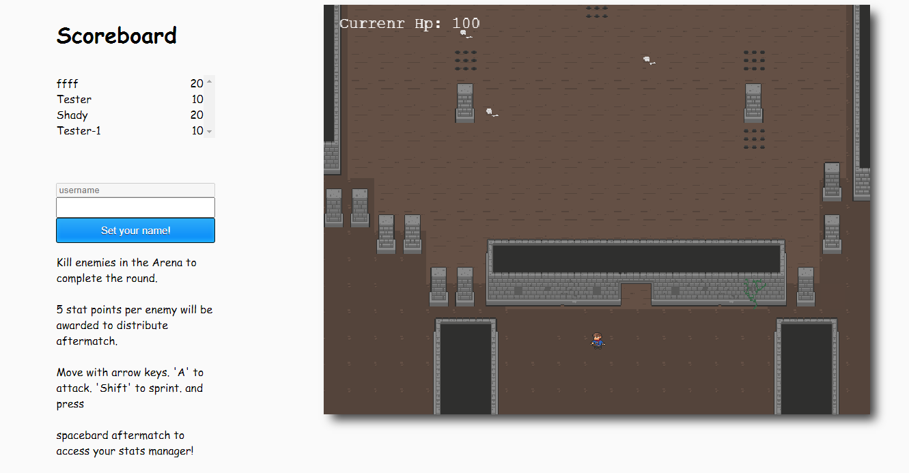
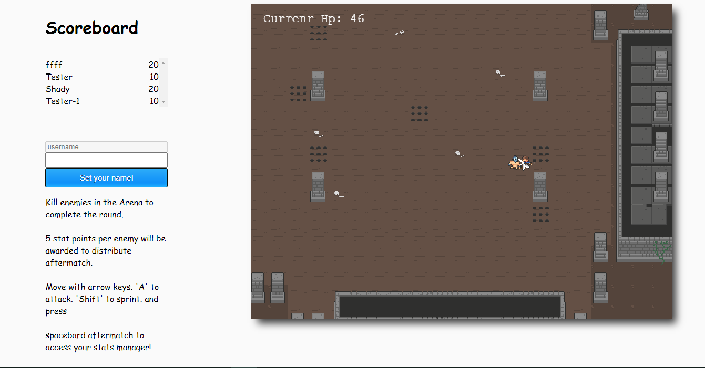

[![Contributors][contributors-shield]][contributors-url]
[![Issues][issues-shield]][issues-url]
 

 
  <h2 align="center">ARPG Concept</h2>
  

     
    <a href="https://github.com/Fig77/new-repo-js/"><strong>Explore the docs »</strong></a>
     
     
    ·
    <a href="https://github.com/Fig77/new-repo-js/issues">Report Bug</a>
    ·
    <a href="https://github.com/Fig77/new-repo-js/issues">Request Feature</a>
  

<!-- ABOUT THE PROJECT -->
## About The Project

An A-RPG concept that you can play from your browser. Will save and display scores using an API. Made with [Phaser 3](https://phaser.io/)

## Table of Contents
- [Built With](#built-with)
- [Prerequisites](#prerequisites)
- [About the game and how to run it](#about-the-game-and-how-to-run-it)
  - [Playing Locally](#playing-locally)
  - [Screenshots](#screenshots)
  - [How To Play](#how-to-play)
  - [Live Version](#live-version)
- [Testing](#testing)
- [Future Improvements](#future-improvements)
- [Credits](#credits)
- [Contributing](#contributing)
- [License](#license)
- [Contact](#contact)

### Built With

* JavaScript
* Phaser
* HTML/CSS
* Node.js
* Webpack

## Prerequisites

- Node.js
- Webpack
- Jest (for running tests)
- A browser for playing!

## About the game and how to run it

Game is roguelike mode (means you start all over if you lose). Survive waves of enemies during each round in an arena. After each match, get points per enemy you kill that you can freely distribute among your character stats. (HP - Speed - Atk). The game will scale abruptly and a certain build my get you through more rounds.

### Playing Locally

Perform the following instructions sequentially.

- git clone https://github.com/Fig77/new-repo-js/.git

- Run `npm install`

- Run `npm start` in your terminal to fire the Webpack server

- Visit http://localhost:8000 on your browser. (Port may change depending on what your computer is using. Check where is running on the console!)

### Screenshots

### Starting Game

### Match

### Game Over

### Live Version

- You can view the app hosted online [here](https://fair-roguelike-concept.netlify.app/).

### How To Play

* Move with your Arrow Keys. Pressing Shift will allow you to sprint (at a 2hp per sprint cost.) 

* Press A to attack your enemy. Abuse collision and their 'shortness of mind' to get through the -totally fair-
difficulty.

* Press spacebar in the lobby (AKA the place where you can still die if you sprint too much.) to get access to the stat menu. You will need to spend 1 stat point after each match if you want to heal.

* After game over you can click submit for uploading score, and keep playing. Or going into the menu, and keep playing.

## Advices

* Since the game is very fair, but also enemies are not very smart, you can easily defeat the first enemy by canceling the A animation. For that, I recommend moving quickly. 
Do note, that damage effect only works after a certain frame of the animation. I can tell you "After frame 34" but that doesn't help in-game.

* After that, with more enemies the cheesy exploit to beat... the first round at least, is to pull them to a corner. Do not let them stack since damage will not be
easy to deal with. To get this working, you need to 'trick' part of the group to start walking to the wrong position. This is how dumb Pacman (their minds when chasing) works:
  - Get on player same X axis.
  - Get close enough to the player on Y axis.
  - If being block while 1), go on Y axis until you can move. (Now, on good Pacman, you try left top right down. Dumb Pacman only picks one.)
  - Same for 2.

*This is a concept game. But, a few things will be updated and patch. Therefore, this might not be useful depending when you read it if I forget to update it.*

## Testing

- Run `npm install`

- Run `npm test` to run the test suites.

<!-- FUTURE IMPROVEMENTS -->

## Future Improvements

* Sprites from the map will be simplified since they were not edited.
* Fully implement pathfinding || Chase algorithm.

See the [open issues](https://github.com/Fig77/new-repo-js/issues) for a list of proposed features (and known issues).

## Contributing
Pull requests are welcome. For major changes, please open an issue first to discuss what you would like to change.

Please make sure to update tests as appropriate.

<!-- LICENSE -->

## License

Distributed under the MIT License. See `LICENSE` for more information.

<!-- CONTACT -->
## Contact📱

* Facundo Iglesias - [Github profile](https://github.com/Fig77)
* Email - fig.igle@gmail.com
* LinkedIn - https://linkedin.com/in/figlesias.com

### Credits

The amazing and a bit butchered by myself, sprites were done by [PixElthen](https://opengameart.org/users/pixelthen)

Thanks to [Scott](https://phasertutorials.com/author/scottwestover2006/) for his tutorials. Especially [Project Template](https://phasertutorials.com/creating-a-phaser-3-template-part-1/)

[contributors-shield]: https://img.shields.io/badge/Contributors-1-%2300ff00
[contributors-url]: https://github.com/Fig77/new-repo-js//graphs/contributors
[issues-shield]: https://img.shields.io/badge/issues-0-%2300ff00
[issues-url]: https://github.com/Fig77/new-repo-js//issues/
