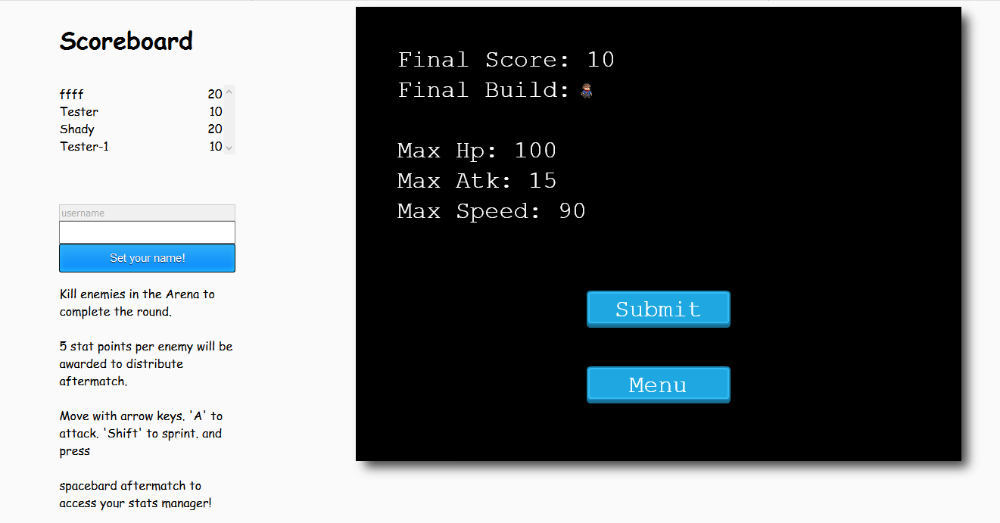

# ARPC concept

[![Contributors][contributors-shield]][contributors-url]
[![Issues][issues-shield]][issues-url]
 

 
  <h2 align="center">ARPG Concept</h2>
  

     
    <a href="https://github.com/Fig77/new-repo-js/"><strong>Explore the docs »</strong></a>
     
     
    ·
    <a href="https://github.com/Fig77/new-repo-js/issues">Report Bug</a>
    ·
    <a href="https://github.com/Fig77/new-repo-js/issues">Request Feature</a>
  

<!-- TABLE OF CONTENTS -->

## Table of Contents

- [About the Project](#about-the-project)
  - [Built With](#built-with)
  - [Prerequisites](#prerequisites)
- [Credit](#credit)
- [Screenshots](#screenshots)
- [How To Play](#how-to-play)
- [Playing Locally](#playing-locally)
- [Testing](#testing)
- [Live Version](#live-version)
- [Future Improvements](#future-improvements)
- [License](#license)
- [Contact](#contact)

<!-- ABOUT THE PROJECT -->

## About The Project

An A-RPG concept, from a top-down perspective. Game is roguelike mode (means you start all over if you lose). Survive waves of enemies during each round in an arena. After each match, get points per every enemy you kill that you can freely distribute among your character stats. (HP - Speed - Atk). Game will scale abruptly and a certain build my get you through more rounds. 

### Built With

This project was Phaser-3.js, a 2D game framework for making HTML5 games for desktop and mobile.

## Prerequisites

- Git
- Node.js
- NPM
- Webpack
- Jest

## Screenshots

### Starting Game

### Match

### Game Over

### How To Play

* Move with your Arrow Keys. Pressing Shift will allow you to sprint (at a 2hp per sprint cost.) 

* Press A to attack your enemy. Abuse collision and their 'shortness of mind' to get through the -totally fair-
difficulty.

* Press spacebar in the lobby (AKA place where you can still die if you sprint too much.) to get access to the stat menu. You will need to spend 1 stat point after each match if you want to heal.

* After game over you can click submit for uploading score, and keep playing. Or going into the menu, and keep playing.

## Playing Locally

Copy the following instructions sequentially into your terminal

- git clone https://github.com/Fig77/new-repo-js/.git

- Run `npm install`

- Run `npm start` in your terminal to fire the Webpack server

- Visit http://localhost:8000 on your browser.

## TestingJavascript-Capstone

- Run `npm install`

- Run `npm test`to run the test suites.

## Live Version

- You can view the app hosted online [here](https:///).

<!-- FUTURE IMPROVEMENTS -->

## Future Improvements

See the [open issues](https://github.com/Fig77/new-repo-js/issues) for a list of proposed features (and known issues).

<!-- LICENSE -->

## License

Distributed under the MIT License. See `LICENSE` for more information.

<!-- CONTACT -->

## Contact

Facundo Iglesias - [Github profile](https://github.com/Fig77)

Project Link: [Project repo](https://github.com/Fig77/new-repo-js/)

<!-- MARKDOWN LINKS & IMAGES -->
<!-- https://www.markdownguide.org/basic-syntax/#reference-style-links -->

[contributors-shield]: https://img.shields.io/badge/Contributors-1-%2300ff00
[contributors-url]: https://github.com/Fig77/new-repo-js//graphs/contributors
[issues-shield]: https://img.shields.io/badge/issues-0-%2300ff00
[issues-url]: https://github.com/Fig77/new-repo-js//issues/